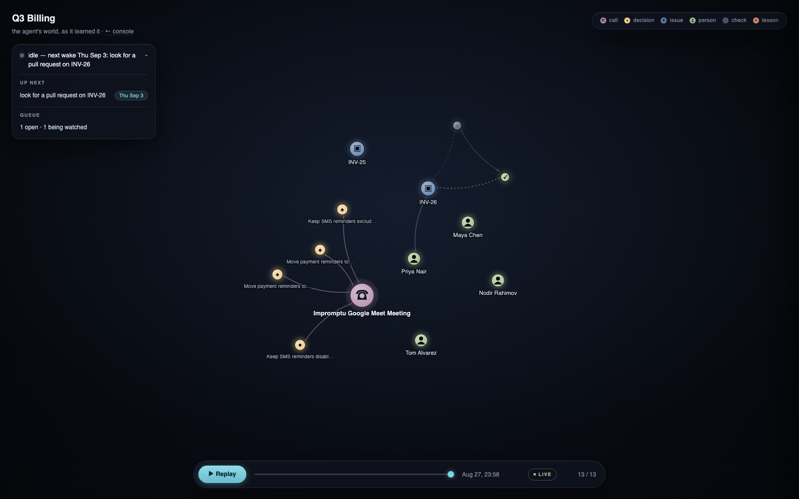
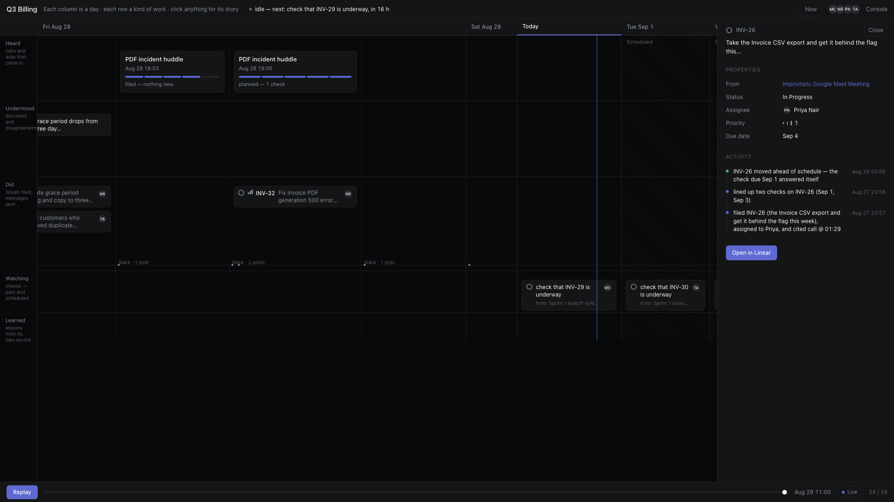
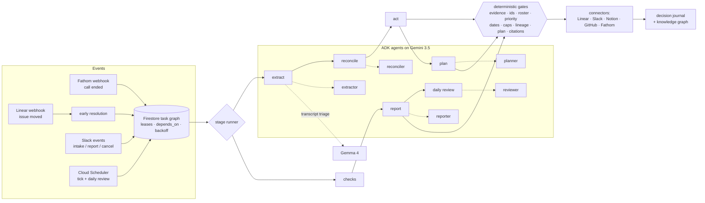

# pm-agent

**An autonomous product manager.** A product call ends; minutes later the decisions are in the
ledger, the action items are cited Linear issues with owners and priorities, the follow-ups are
scheduled as a dependency graph, and the team was told in Slack — with a revert button on every
action. Nobody prompted it. Nobody approved each step. That is the point.

Built solo for the **All Things Agentic Hackathon 2026** (Taskmaster track) on Gemini 3.5,
Google ADK, and Google Cloud.



## The loop

pm-agent runs 24/7 on Cloud Run, driven by a Cloud Scheduler tick and webhooks:

1. **Extract** — a Fathom call recording lands; Gemma triages the transcript down to its
   decision-bearing lines, then Gemini extracts decisions, action items, owners, and dates —
   every one backed by a verbatim quote or dropped.
2. **Reconcile** — each item is checked against what already exists in Linear, Notion, and the
   codebase. "Build CSV export" becomes *update INV-25*, not a duplicate ticket. Conflicts
   between what was said and what is written are reported, never silently resolved.
3. **Act** — issues are filed with citations, owners from the roster (never invented), and
   priorities that require an escalation quote to exceed their band. Every write records its
   revert payload *before* it happens.
4. **Plan** — the agent schedules its own follow-ups as a dependency graph: *check the issue is
   underway Sep 1 → then look for a PR Sep 3 → then check it merged*. Blocked checks wait on
   their dependencies; failures cascade by declared policy (skip / run anyway / cancel).
5. **Watch and react** — good news resolves early: when an engineer moved INV-26 four days ahead
   of schedule, the Linear webhook resolved the Sep 1 check within seconds and unblocked its
   dependents. Bad news waits for its deadline, then nudges — once, politely, within caps.
6. **Report** — at sprint end (and on request in Slack) it writes the product report. Every
   claim carries a citation; the citation gate removes any claim it cannot prove.
7. **Learn** — a daily review turns the day's evidence into lessons that feed the next day's
   planning. Lessons without evidence from that day's record are refused.

All of it is visible live: the **[console](https://pm-agent-999960779013.us-central1.run.app/console)**
is the agent's decision journal, and the
**[graph](https://pm-agent-999960779013.us-central1.run.app/console/graph)** is its world — every
call, decision, issue, person, check, and lesson, with a replay scrubber that plays the story
back from the first event, a **Now dock** showing what it is doing this second, and a story
panel on every node.



## The autonomy stance

Most agent products put a human approval in front of every action. The evidence says that
theater fails: Anthropic's engineering team found users approved **~93% of permission prompts**
— approval fatigue turns oversight into a rubber stamp. And OpenAI's own internal orchestrator,
Symphony, explicitly declines dependency ordering and verification as "not a policy" concern.

pm-agent takes the opposite bet, and makes it safe three ways:

| Instead of | pm-agent does |
|---|---|
| Approval prompts before each action | **Act-then-notify with one-click revert** — every Slack post carries revert/wrong buttons wired to the action's stored revert payload |
| Trusting the model's claims | **Deterministic gates** on every output: evidence quotes, re-fetched identifiers, roster membership, priority bands, citation coverage — see [GATES.md](GATES.md) |
| Failing open when unsure | **Failing closed, honestly** — a failed gate gets one retry with specific feedback, then a logged drop; a starved pipeline degrades to silence, never to fabrication |
| A human scheduling follow-through | **A self-scheduling task graph** — the agent enqueues, orders, blocks, and early-resolves its own future work; a lineage gate (depth ≤ 4, children ≤ 12) stops runaway self-employment |

## Architecture



(The same diagram as an image, for viewers without Mermaid: `docs/media/architecture.png`.)

**Queue as orchestrator.** There is no workflow engine: the Firestore task graph *is* the
orchestrator. Tasks carry `due_at`, leases, `depends_on`, and failure policy; a one-minute tick
drains everything due and promotes whatever became unblocked. Plans materialise atomically —
a plan that fails its gate materialises nothing.

*Why not ADK's workflow agents?* ADK's `SequentialAgent` / `ParallelAgent` orchestrate within
one model turn; this agent's work spans days, survives restarts, and must be inspectable and
revertible after the fact. So ADK does what it is best at — the five reasoning steps, with
schema-enforced output and guarded tools — and a durable, deterministic queue does the
sequencing. An orchestrator that a model can talk into a loop is the one thing this system
refuses to have.

**Intent before effect.** Every external write is recorded with an idempotency key and its
revert payload before the connector call. Replays are detected by key; reverts are one click.

**Two models, deliberately.** Gemini 3.5 (`flash` / `flash-lite`) powers the five reasoning
agents through ADK — structured output enforced by schema, tools guarded per-agent by an
allowlist. Gemma 4 (31B) handles transcript triage and Slack intent classification — cheap
classification where the failure posture matters more than brilliance: triage fails open
(keeps every line), intent defaults to "request".

**Google Cloud.** Cloud Run (the service), Firestore (tasks, events, actions, decisions,
lessons, wiki), Cloud Scheduler (tick + daily review), Secret Manager (every credential).

## How it talks

Everything the agent says in Slack goes through one voice layer (`app/harness/core/voice.py`)
that turns the four things a colleague talks about — a person by first name, a ticket by what it
is, a day rather than a date, and what happens next — into words. So a nudge reads
*"Nodir — INV-27 (the duplicate reminders bug) hasn't started, and it was meant to be underway
today. Anything in the way?"* rather than a log line. Assumptions are stated inline, once
(*"due Monday — from 'by Monday' on the call"*); the first check of anything someone asked for
reports back before the rest go quiet; and tone is enforced like a gate — tests fail if any
message contains a task kind, an "(s)" plural, "the assignee", or a bare URL, and each message
type has a length ceiling. The charter, and the research behind it (Claude in Slack, Viktor,
Slack's own guidance), is in `docs/research/slack-voice.md`; every message the agent can send
renders with `uv run python scripts/preview_slack.py`.

## Guarantees, measured

The eval harness replays the full pipeline against the fixture company and asks 27 questions —
recall, judgment, and hard guarantees. Six runs on free-tier quota, `gemini-3.5-flash-lite`:

| Metric | Result across all 5 runs |
|---|---|
| Fabricated identifiers | **0** |
| Report citation coverage | **100%** |
| Invalid plans materialised | **0** |
| Judgment accuracy | 74–92% (mean 83%); 58% on one quota-starved run |

Two runs are the instructive ones. The quota-starved run scored 15/26 because back-to-back
runs exhausted the API mid-pipeline; the 20/27 run had no rate limiting at all — the small model
simply extracted fewer items and planned nothing that time. In both, the guarantees held: a
starved or unlucky pm-agent writes *less*, cites *nothing false*, invents *no identifiers*. It
degrades to silence, never to lies — and the judgment spread is the argument for running the
reasoning agents on a stronger Gemini tier in production, which is a one-line config change
(`PM_MODEL_STRONG`). Full results in `evals/results/`.

## Run it

```
uv sync --dev
cp .env.example .env          # then fill in GOOGLE_API_KEY
uv run ruff check . && uv run mypy app && uv run lint-imports && uv run pytest -q
```

Anything needing credentials takes `--env-file .env`:

```
uv run --env-file .env python scripts/list_models.py
uv run --env-file .env pytest -m live
```

Deploy is `deploy/deploy.sh` (Cloud Run), `deploy/scheduler.sh` (jobs); the full runbook
including Firestore composite indexes lives in `deploy/secrets.md`.

The demo company — **Acme Invoicing**, its roster, call transcript, codebase
([alijon30/acme-invoicing](https://github.com/alijon30/acme-invoicing)), and Linear project —
is entirely synthetic, built for this hackathon.

## Roadmap

- **Slack Socket Mode + Bolt** — richer interactive surfaces (modals, home tab) beyond the
  current HTTP events + status-message-edit + emoji-reaction patterns.
- **Prompt-injection classifier** ahead of extract — transcripts are untrusted input.
- **Human-review states** for the rare action class where act-then-revert is not enough
  (deletes, cross-org posts).
- **Audience-shaped reports** — the same evidence, phrased for engineers vs. stakeholders.
- **Routines** — recurring intake commitments ("every Friday, summarise open risks").

## Design docs

The full design spec is at `docs/superpowers/specs/2026-08-26-pm-agent-design.md`; the
research that shaped the autonomy stance is in `docs/research/` (Anthropic and OpenAI PM
practice reviews, with sources).
