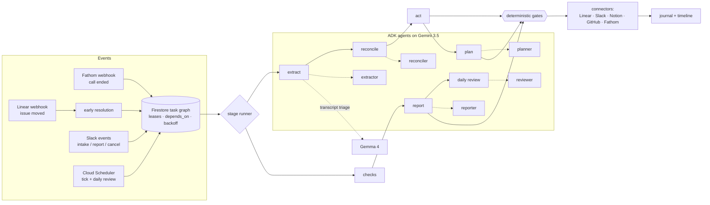

# pm-agent

An autonomous product manager, built for Google's All Things Agentic Hackathon 2026
(Taskmaster track) with Gemini 3.5, Google ADK, and Google Cloud.

A product call ends. A few minutes later the decisions are recorded, the action items are
Linear tickets with owners and citations, follow-up checks are scheduled for the right days,
and the team gets a Slack summary with a revert button on every action. Nobody approved each
step.


Live demo: [graph](https://pm-agent-999960779013.us-central1.run.app/console/graph) ·
[console](https://pm-agent-999960779013.us-central1.run.app/console)

## What it does

- Extracts decisions and action items from call transcripts. Gemma filters the transcript,
  Gemini 3.5 extracts. Anything without a verbatim quote from the call is dropped.
- Checks each item against Linear, Notion and the codebase before filing. Updates existing
  tickets instead of duplicating them; reports conflicts instead of resolving them silently.
- Schedules its own follow-ups as a dependency chain: check the issue is underway, then look
  for a PR, then check it merged. Each check states what happens if it fails.
- Reacts to webhooks. If an engineer moves a ticket four days early, the pending check
  resolves in seconds and its dependents unblock.
- Posts a morning standup, takes requests in Slack, and writes sprint reports where every
  claim carries a citation the system re-verified.
- Remembers instructions. "From now on, billing tasks go to Nodir" becomes a standing rule it
  applies and cites. Corrections from the "Something's wrong" button feed back into later runs.
- Reviews its own record daily and turns it into lessons for the next day's planning.

The graph shows all of this as a timeline (columns are days, rows are kinds of work, future
days hold the schedule); the console is a dashboard computed from the same records: median
time from call to tickets, days saved by early resolutions, citation coverage, gates passed,
reverts.


## Why no approval prompts

Anthropic's engineers measured that users approve ~93% of permission prompts. That isn't
oversight. So instead of asking first:

- Every action is recorded before it happens, with an idempotency key and a revert payload.
  Undo is one click in Slack.
- Deterministic gates check every model output: quotes must exist in the transcript,
  identifiers are re-fetched from the systems that own them, owners must be on the roster,
  a priority above its band needs a spoken escalation, report claims need citations.
  [GATES.md](GATES.md) documents them and is generated from the code, so it can't drift.
- A failed gate gets one retry with specific feedback, then a logged drop. When the pipeline
  is starved (rate limits, model flakes) it writes less, never something false.

## How it works



(Same diagram as an image: `docs/media/architecture.png`.)

There is no workflow engine. The Firestore task queue is the orchestrator: tasks carry due
times, dependencies, leases and retry backoff. Cloud Scheduler hits `/tick` every minute; the
handler claims whatever is due (transactionally, so a duplicate tick can't double-run a task)
and executes it, which enqueues the next stage. Cloud Run scales to zero between requests.
Secrets live in Secret Manager. Deploys build on Cloud Build and ship from Artifact Registry.

I didn't use ADK's workflow agents for sequencing on purpose: this work spans days, has to
survive restarts, and has to be revertible after the fact. ADK does the five reasoning steps
(schema-enforced output, per-agent tool allowlists); a durable queue does the ordering.

Gemma 4 handles transcript triage and Slack intent classification. Both fail safe: triage
keeps everything it can't classify, intent defaults to "request".

## Numbers

Six eval runs against the fixture company, on free-tier quota:

| | |
|---|---|
| Fabricated identifiers | 0 |
| Report citation coverage | 100% |
| Invalid plans materialised | 0 |
| Judgment accuracy | 74–92% |

The bad runs matter more than the good ones. Quota starvation and small-model variance lower
recall, but the guarantees held every time: fewer tickets, never a false one. Full results in
`evals/results/`.

## Run it

```
uv sync --dev
cp .env.example .env          # fill in GOOGLE_API_KEY
uv run ruff check . && uv run mypy app && uv run lint-imports && uv run pytest -q
```

Anything needing credentials takes `--env-file .env`:

```
uv run --env-file .env python scripts/list_models.py
uv run --env-file .env pytest -m live
```

Deploy: `deploy/deploy.sh` and `deploy/scheduler.sh`; runbook and required Firestore indexes
in `deploy/secrets.md`. To feed it a call without Fathom:
`uv run --env-file .env python scripts/send_call.py fixtures/transcripts/03-pdf-incident-huddle.md --title "PDF incident huddle" --recording-id demo1`

The demo company (Acme Invoicing — roster, calls, codebase at
[alijon30/acme-invoicing](https://github.com/alijon30/acme-invoicing)) is synthetic. The
tickets, webhooks and standups are real.

## Roadmap

Slack Socket Mode, a prompt-injection classifier ahead of extract, human-review states for
actions where revert isn't enough, audience-shaped reports, recurring routines.

Design spec: `docs/superpowers/specs/2026-08-26-pm-agent-design.md` · research notes:
`docs/research/`
