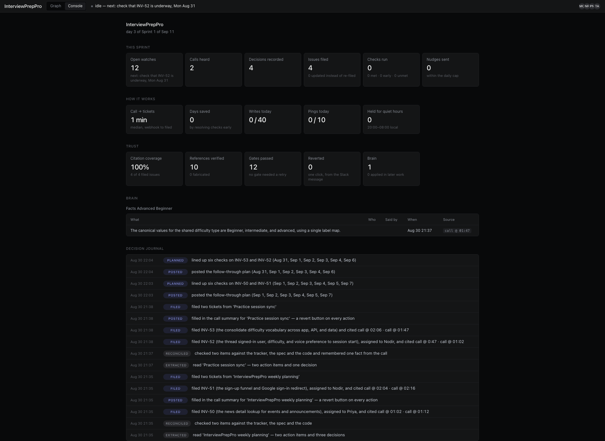
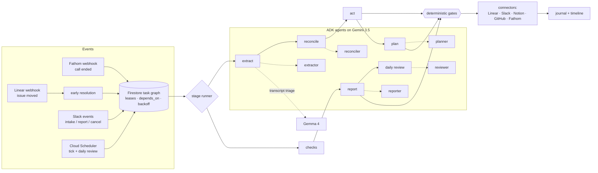

# Autonomous PM Agent

Built for Google's All Things Agentic Hackathon 2026 (Taskmaster track) with Gemini 3.5,
Google ADK, and Google Cloud. Repo name: `pm-agent`.

A product call ends. A few minutes later the decisions are recorded, the action items are
Linear tickets with owners and citations, follow-up checks are scheduled for the right days,
and the team gets a Slack summary with a revert button on every action. Nobody approved each
step.


Live demo: [graph](https://pm-agent-999960779013.us-central1.run.app/console/graph) ·
[console](https://pm-agent-999960779013.us-central1.run.app/console)

## What it does

- Extracts decisions and action items from call transcripts. Gemma filters the transcript,
  Gemini 3.5 extracts. Anything without a verbatim quote from the call is dropped.
- Checks each item against Linear, Notion and the codebase before filing. Updates existing
  tickets instead of duplicating them; reports conflicts instead of resolving them silently.
- Schedules its own follow-ups as a dependency chain: check the issue is underway, then look
  for a PR, then check it merged. Each check states what happens if it fails.
- Reacts to webhooks. If an engineer moves a ticket four days early, the pending check
  resolves in seconds and its dependents unblock.
- Posts a morning standup, takes requests in Slack, and writes sprint reports where every
  claim carries a citation the system re-verified.
- Remembers instructions. "From now on, billing tasks go to Nodir" becomes a standing rule it
  applies and cites. Corrections from the "Something's wrong" button feed back into later runs.
- Reviews its own record daily and turns it into lessons for the next day's planning.

The graph shows all of this as a timeline (columns are days, rows are kinds of work, future
days hold the schedule); the console is a dashboard computed from the same records: median
time from call to tickets, days saved by early resolutions, citation coverage, gates passed,
reverts.




## Why no approval prompts

Anthropic's engineers measured that users approve ~93% of permission prompts. That isn't
oversight. So instead of asking first:

- Every action is recorded before it happens, with an idempotency key and a revert payload.
  Undo is one click in Slack.
- Deterministic gates check every model output: quotes must exist in the transcript,
  identifiers are re-fetched from the systems that own them, owners must be on the roster,
  a priority above its band needs a spoken escalation, report claims need citations.
  [GATES.md](GATES.md) documents them and is generated from the code, so it can't drift.
- A failed gate gets one retry with specific feedback, then a logged drop. When the pipeline
  is starved (rate limits, model flakes) it writes less, never something false.

## How it works



(Same diagram as an image: `docs/media/architecture.png`.)

There is no workflow engine. The Firestore task queue is the orchestrator: tasks carry due
times, dependencies, leases and retry backoff. Cloud Scheduler hits `/tick` every minute; the
handler claims whatever is due (transactionally, so a duplicate tick can't double-run a task)
and executes it, which enqueues the next stage. Cloud Run scales to zero between requests.
Secrets live in Secret Manager. Deploys build on Cloud Build and ship from Artifact Registry.

I didn't use ADK's workflow agents for sequencing on purpose: this work spans days, has to
survive restarts, and has to be revertible after the fact. ADK does the five reasoning steps
(schema-enforced output, per-agent tool allowlists); a durable queue does the ordering.

Gemma 4 handles transcript triage and Slack intent classification. Both fail safe: triage
keeps everything it can't classify, intent defaults to "request".

## Numbers

Six eval runs against the fixture company, on free-tier quota:

| | |
|---|---|
| Fabricated identifiers | 0 |
| Report citation coverage | 100% |
| Invalid plans materialised | 0 |
| Judgment accuracy | 74–92% |

The bad runs matter more than the good ones. Quota starvation and small-model variance lower
recall, but the guarantees held every time: fewer tickets, never a false one. Full results in
`evals/results/`.

## Try it

The live instance is the easiest way: open the
[graph](https://pm-agent-999960779013.us-central1.run.app/console/graph) and the
[console](https://pm-agent-999960779013.us-central1.run.app/console).

To run your own, you need a Gemini API key and a Firestore to write to. The quickest
Firestore is the local emulator, which needs no Google Cloud account at all:

```
gcloud emulators firestore start --host-port=127.0.0.1:8790   # keep running
```

Then, in another terminal:

```
uv sync
cp .env.example .env          # fill in GOOGLE_API_KEY; set PM_GCP_PROJECT=demo
                              # and PM_FATHOM_WEBHOOK_SECRET=whsec_ZGVtbw== (any
                              # whsec_ value: send_call signs with the same secret)
export FIRESTORE_EMULATOR_HOST=127.0.0.1:8790
uv run --env-file .env python scripts/seed_project.py   # writes the project config + roster
uv run --env-file .env uvicorn app.main:create_default_app --factory --port 8080
```

(Have a real GCP project? Skip the emulator lines, set `PM_GCP_PROJECT` to your project id,
and run `gcloud auth application-default login` — Firestore in Native mode is all it needs.)

The connectors are optional; leave a key empty and the stages that need it fail closed with
a reason instead of crashing:

| Key | What filling it enables |
|---|---|
| `PM_LINEAR_API_KEY` | issues get filed in Linear for real |
| `PM_NOTION_TOKEN` | docs join reconciliation |
| `PM_SLACK_BOT_TOKEN` + `PM_SLACK_SIGNING_SECRET` | summaries, plans, standups, the revert button |
| `PM_GITHUB_TOKEN` + `PM_GITHUB_REPO` | the pull-request checks |

Then feed it a call (no Fathom account needed, the webhook payload carries the transcript):

```
uv run --env-file .env python scripts/send_call.py \
  fixtures/transcripts/03-pdf-incident-huddle.md \
  --url http://127.0.0.1:8080/webhooks/fathom \
  --title "PDF incident huddle" --recording-id demo1
```

Deploying to Cloud Run: `deploy/deploy.sh` and `deploy/scheduler.sh`; the runbook and the
Firestore indexes you'll need are in `deploy/secrets.md`.

Tests, if you're changing things: `uv run pytest -q` (893 tests, no credentials needed).

The demo project is **InterviewPrepPro** — my own real product (an F-1 visa interview coaching
app). A trimmed copy of its source is vendored in `fixtures/interviewpreppro/`, so the agent's
investigations point at real files and lines. The roster and calls are staged; the tickets,
webhooks, standups and code are real. (The evals run against a fully synthetic company, Acme Invoicing, whose tiny
codebase lives under `tests/fixtures/` — test scaffolding, not demo data.)

## Roadmap

More trackers behind the same connector seam, deeper PR awareness, a brain that spans
projects, a prompt-injection classifier ahead of extract, and human-review states for actions
where revert isn't enough.

Research notes: `docs/research/`
