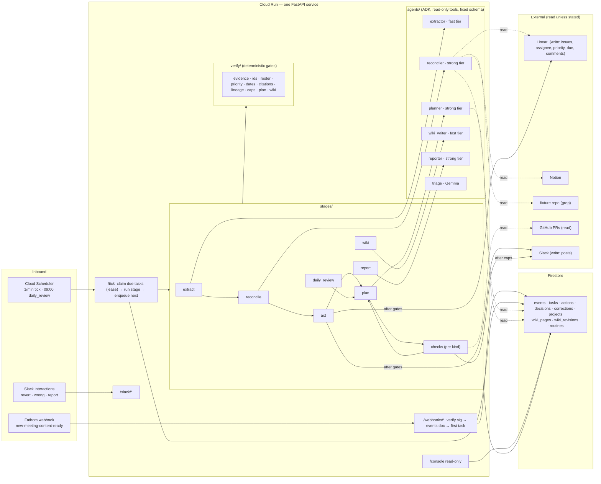

# PM Agent — Design

**Status:** approved design, 2026-08-26 (rev 2: planner/task graph + company brain, same day)
**Deadline:** All Things Agentic Hackathon submission, 2026-08-31 17:00 PDT
**Track:** The Taskmaster (event-driven workflow with autonomous routing)
**Team:** one person

---

## 1. What it is

An autonomous product-manager agent for a software team. A product call ends;
within minutes the agent has extracted the decisions and action items, checked
each one against the tracker, the spec, the code and its own company brain,
created and assigned the tickets, told the team what it did — with a one-tap
revert on every action — and **planned its own follow-through**: a small graph
of future checks with dependencies ("verify the PR exists, but only after the
issue is in progress"), which it executes, observes, and re-plans every morning.
Everything it verifies along the way is filed into a wiki-style knowledge graph
of the company, so each run knows more than the last. On request it writes a
project status report.

It acts on its own. It never guesses: every ticket it writes cites the moment in
the call that justified it, every identifier it uses was looked up, every fact
in the brain carries a source, and when two sources disagree it says so instead
of picking a winner.

Origin: DataTruck's internal "Product Agent v0" requirements. The hackathon
build is v0 plus the write side that document deferred, built with the approval
flow and audit trail it said writes needed first. The demo runs against a
synthetic company; no DataTruck data appears anywhere.

## 2. Why this shape

The Taskmaster deep-dive describes "an event-driven workflow with autonomous
routing … watching for a change, figuring out what needs to happen next, and
interacting with different apps to get the job done." Its own example is an
automated PM that reads transcripts and files tickets. That is also the most
obvious entry in the track, so this design wins on what the example lacks:

1. **A planner, not a cron.** The agent authors its own task graph — timed
   checks with dependencies, nudges, escalations — and re-plans daily against
   reality. A durable queue with lineage enforces it.
2. **A company brain.** Verified facts accumulate into a cited, wiki-style
   knowledge graph the agent reads before it re-derives anything.
3. **Triangulation before action.** Every extracted item is reconciled against
   Linear (duplicate? exists?), Notion (contradicts the spec?), the code (what
   does it do today?) and the brain (what did we already establish?).
4. **Trust as engineering.** Gates the model cannot talk past: verbatim
   evidence, identifier existence, roster membership, priority band, caps,
   plan validity. Fully autonomous *and* safe to leave running overnight.

Judging weights: Innovation & Operational Utility 40%, Architectural
Discipline 30%, Demo & Production Readiness 30%; +0.2 bonus each for a blog
post, a social post, and each additional Google model (Gemma is used).

## 3. Scope

**In (the spine):**

- Fathom call → extract decisions, action items, open questions (with evidence)
- Reconcile each item against Linear, Notion, the fixture codebase, and the brain
- Act: create/update Linear issues; set assignee, priority, due date under
  policy; post a summary to Slack with revert buttons
- **Plan:** after Act, and every morning (`daily_review`), the planner emits a
  validated task graph — checks, nudges, escalations, with dependencies and
  timing — which the queue executes and feeds back
- **Checks** (executors per task kind): issue state, PR exists / reviewed /
  merged, nudge, escalate; results recorded and re-planned
- **Company brain:** deterministic bootstrap from Linear/Notion/code/roster;
  every stage files cited facts into wiki pages; `search_wiki` tool for the
  reconciler, planner and reporter; Obsidian-compatible vault export
- Correction loop: "wrong" on any post → stored correction → applied to future
  runs as a soft prompt rule
- Decision ledger: every decision from a call is persisted with its source
- Status report on request (Slack), one shape
- Read-only web console: one page — task graph, audit log, wiki page list
- Eval set (~25 known-answer questions) run against the fixtures
- Gemma for triage classification (Slack message intent; transcript segment
  pre-filter)

**Out (README roadmap, not built):** free-form Q&A, writing to support
articles, adoption/user-report analysis, report shaping by recipient role,
model-written wiki page summaries (facts + links only), hard-rule corrections
(gate rules from corrections), Linear webhook ingress (checks poll instead),
cross-team dependency detection, MCP tool transport, Vertex AI Memory Bank,
any crawler that reads sources the agent was not already working on (the brain
grows only from verified work plus the bootstrap).

## 4. Architecture

**Principle: one runtime, one database, no message bus.** Firestore is the
queue, the audit log, the brain and the memory. Cloud Scheduler ticks once a
minute; Cloud Run does the work.



**Google Cloud services used:** Cloud Run (runtime), Firestore (queue, audit,
brain, memory; vector search for wiki retrieval), Cloud Scheduler (tick and
daily review), Secret Manager (credentials), Cloud Trace (OpenTelemetry spans
from ADK plus one parent span per task). Models via the Gemini API: fast and
strong Gemini tiers (config), a Gemini embedding model, Gemma 3. Agent
framework: ADK (Python).

**The agent boundary in one sentence:** Gemini reads and proposes inside a
stage — items, plans, wiki facts — with read-only tools and a fixed output
schema; deterministic Python owns every queue write, every gate, and every
side effect.

### 4.1 Why not Pub/Sub, Cloud Tasks, Agent Engine, or a SequentialAgent

- Webhook handlers write two Firestore docs and return 200 — no bus needed to
  ack fast. A one-minute tick with lease-based claiming gives crash-resumable,
  at-least-once execution with no extra service. Swapping the tick for Cloud
  Tasks is confined to `store/tasks.py`.
- Agent Engine deploys are slow to iterate and its runtime is opaque; write
  governance would have to be bolted around it. Bad trade solo in five days.
- ADK's `SequentialAgent` has no checkpoint between steps; a crash restarts
  from zero. Our stages are separate durable tasks, so a crash resumes at the
  stage that died. The queue is the orchestrator; ADK agents are the workers.

### 4.2 The planner is not the scheduler

The model never calls `enqueue`. It emits a **plan** — a typed task graph —
and `verify/plan.py` validates it before the queue materialises it in one
transaction. The model gets the full power to wire up its own follow-through
(kinds, params, timing, dependencies, what to do when a check is unmet)
through a whitelist and a gate, never through queue access. This is the same
propose → validate → execute pattern every write follows.

## 5. Data model

Nine Firestore collections. Everything crossing a task boundary is JSON-native
(dicts and lists, never dataclasses).

| Collection | One doc = | Fields |
|---|---|---|
| `events` | one inbound webhook or click | `provider`, `provider_event_id` (idempotency key), `payload`, `received_at`, `project_id`, `notes[]` |
| `tasks` | one unit of scheduled work | `kind`, `params`, `payload`, `due_at`, `status` (queued · blocked · leased · done · failed · deferred · skipped · cancelled), `lease_until`, `attempts`, `result`, `error`, `reason`, `project_id`; **graph:** `key` (planner's handle, unique per plan), `plan_id`, `depends_on[]` (task ids), `on_dep_failed` (skip · run_anyway · cancel), `on_unmet` (none · nudge_assignee · nudge_reviewer · escalate_channel), `context` (issue ids, people, decision ids); **lineage:** `root_event_id`, `parent_task_id`, `depth`, `refused_enqueues[]`; `finished_at`, `defer_reason` |
| `actions` | one side effect the harness performed | `kind` (linear.create_issue · linear.update_issue · linear.assign · linear.set_priority · linear.set_due · linear.comment · slack.post), `status` (pending · done · failed · reverted), `idempotency_key`, `target_ids`, `inputs`, `citations[]`, `checks_passed[]`, `revert`, `reverted_at`, `reverted_by`, `task_id`, `project_id` |
| `decisions` | one decision extracted from a call | `statement`, `rejected_options[]`, `source` (`fathom:<meeting_id>@<mm:ss>`), `quote`, `linked_issue_ids[]`, `project_id`, `event_id` |
| `corrections` | one human correction | `scope` (project · global), `stage`, `wrong`, `right`, `matcher`, `source_action_id`, `author_slack_id` |
| `projects` | one configured project | `slug`, `linear_team_id`, `linear_project_id`, `notion_root_page_id`, `slack_channel_id`, `code_repo`, `timezone`, `roster[]`, `policy` (§9) |
| `wiki_pages` | one entity page | `slug`, `type` (person · issue · decision · spec · module · topic · meeting · customer), `title`, `aliases[]`, `facts[]` (`text`, `source`, `added_by_task`, `at`, `superseded_by`), `links[]` (`to` slug, `rel`), `conflicts[]` (`about`, `sides[]` each with `claim` + `source`), `revision`, `updated_at`, `embedding` (vector) |
| `wiki_revisions` | one append-only change to a page | `slug`, `revision`, `task_id`, `facts_added[]`, `links_added[]`, `at` |
| `routines` | one recurring trigger per project | `kind` (daily_review), `cron`, `timezone`, `last_fired_at`, `enabled` |

Idempotency key for actions: `sha256(root_event_id + item_index + kind)[:16]`,
also stamped into the Linear issue description as a hidden footer
(`<!-- pm-agent:<key> -->`) so Act can detect its own prior write.

## 6. The queue

- **Enqueue** = create a `tasks` doc with `due_at`. Immediate work has
  `due_at = now`. A task with unmet `depends_on` is created as `blocked`.
- **Tick** (`/tick`, Cloud Scheduler with a shared token) runs one transaction
  per due task: `queued|deferred → leased`, `lease_until = now + 15 min`. Then
  runs the stage under a 10-minute hard timeout, so a live stage can never
  outlast its own lease. On completion it marks `done` and creates child tasks
  **in the same transaction** — "did the work but failed to schedule the
  follow-up" cannot happen.
- **Dependencies.** Completing a task promotes each dependent whose
  dependencies are now all `done` (`blocked → queued`). A terminal failure
  applies each dependent's `on_dep_failed`: `skip` (default; dependent becomes
  `skipped`), `run_anyway`, or `cancel` (dependent and its own dependents become
  `cancelled`). Cancellation cascades.
- **Plan materialisation.** A plan's tasks are created together in the
  completing task's transaction; `depends_on` keys are resolved to ids within
  the batch. Keys a plan marks as `supersedes` cancel the matching open tasks
  (and their dependents) in the same transaction.
- **Lease expiry** = crash recovery; the next tick reclaims and `attempts`
  increments.
- **Lineage gate at enqueue** (`verify/lineage.py`): refuse if
  `depth > policy.max_depth` (default 4) or the parent already has
  `policy.max_children` (default 12 — a plan is one parent with several
  children). A refused enqueue is recorded in the parent's `result`. Plan
  generations count as depth, so an agent that keeps planning follow-ups to
  its follow-ups stops at the limit and says so.
- **Caps gate at enqueue and at act** (`verify/caps.py`): daily writes per
  project, daily pings per project, quiet hours, `max_open_tasks`. Exceeding →
  `status: deferred`, `due_at = next window` (or the plan is trimmed with a
  recorded reason). Nothing is dropped silently.
- **Ordering:** the tick processes due tasks oldest-first, sequentially per
  request (Cloud Run request timeout 15 min).

## 7. Stages and gates

Each stage is `run(task, deps) -> StageResult(result, children)`. Gemini does
judgment inside; deterministic Python decides what leaves. A gate failure gives
the model **one bounce** with the specific failure; a second failure drops the
item, and the drop is recorded and reported.

### 7.1 extract
- **Input:** Fathom transcript (speaker-labelled, timestamped), summary, action
  items; roster names.
- **Agent:** `extractor` (fast tier, no tools), `output_schema = ExtractResult`;
  every item has `evidence[] = { quote, timestamp, speaker }`.
- **Pre-filter:** `triage` (Gemma) labels segments decision-bearing / chatter.
- **Gate — evidence:** each item must carry ≥1 quote that string-matches the
  transcript after normalisation. No match → dropped.
- **Enqueues:** `reconcile`, `wiki` (meeting + decision pages). **Persists:** `decisions`.

### 7.2 reconcile
- **Agent:** `reconciler` (strong tier) with read-only tools: `search_wiki`,
  `get_page`, `search_issues`, `get_issue`, `search_notion`, `get_notion_page`,
  `grep_code`, `list_roster`. The instruction tells it to consult the brain
  first. `output_schema = ReconcileResult`.
- **Per item:** `disposition` (new · update `<ID>` · duplicate_of `<ID>`),
  `conflicts[]` (code_vs_spec · spec_vs_call · ticket_vs_call · brain_vs_call,
  evidence from each side), `owner`, `priority`, `due` (only if stated),
  `title`, `description` (with citations), `facts[]` for the wiki (each with a
  source).
- **Gate — ids:** every Linear ID, Notion page, roster name, wiki slug is
  re-fetched; unknown → bounce once, then `unverified` and excluded from Act.
- **Source unavailable:** typed `SourceUnavailable` → item `unverified`; the
  task re-enqueues itself once for +30 min.
- **Enqueues:** `act`, `wiki`.

### 7.3 act (deterministic — the only stage with Linear/Slack side effects)
- **Gates, in order:** roster · priority band (leave `policy.priority_band`
  only with an escalation quote) · dates · caps.
- **Intent before effect:** `actions` doc `pending` → write → `done` with
  `revert`. On lease reclaim, look for the idempotency footer before rewriting.
- **Writes:** create/comment issues (description = quote + Fathom link + spec
  check + code check + brain link + related issues + decision id + footer);
  assignee / priority / due; one Slack post per call with **revert** per action
  and **wrong** per post. Conflicts posted as "sources disagree", never resolved.
- **Enqueues:** `plan` (with the created/updated issues, owners, due hints,
  decision ids as context), `wiki`.

### 7.4 plan
- **When:** after `act` (follow-through for what was just created) and as the
  target of the `daily_review` routine (re-plan the project against reality).
- **Agent:** `planner` (strong tier) with read-only tools: `search_wiki`,
  `get_page`, `get_issue`, `list_open_tasks`, `list_recent_results`,
  `get_pr_status`. `output_schema = Plan`.
- **Plan shape:** `tasks[]` each `{ key, kind, params, due, depends_on[keys],
  reason, on_unmet, on_dep_failed, context }`, plus `supersedes[]` (keys or task
  ids of now-obsolete open tasks) and `notes` (what the planner observed).
- **Gate — plan** (`verify/plan.py`): every `kind` ∈ catalog (§7.5); `params`
  validate against the kind's schema; keys unique; `depends_on` resolve within
  the plan or to existing open tasks; graph acyclic; `due` within
  `policy.plan_horizon_days` and not in the past; size ≤ `policy.max_plan_size`;
  open tasks + new ≤ `policy.max_open_tasks`; every issue / person / PR
  referenced in `params` exists (ID gate). Fails closed with the reason; one
  bounce; then the plan is trimmed to the valid subset and the trim is recorded.
- **Materialised** by the queue in one transaction (§6). Default follow-through
  when the planner has nothing better: checks at `due − 1d`, `due`, `+3d`.

### 7.5 checks — the task kinds catalog (`app/kinds/`)

The whitelist of what the planner may schedule. Each kind = param schema +
executor + allowed `on_unmet` actions. Adding a capability = one entry.

| Kind | Params | Executor observes | Unmet actions |
|---|---|---|---|
| `check_issue_state` | `issue`, `expect[]` | Linear state ∈ expect? | nudge_assignee · escalate_channel |
| `check_pr_exists` | `issue` | a PR references the issue? | nudge_assignee |
| `check_pr_reviewed` | `issue` or `pr` | ≥1 review on the PR? | nudge_reviewer |
| `check_pr_merged` | `issue` or `pr` | PR merged? | nudge_assignee · escalate_channel |
| `nudge` | `person`, `about`, `template` | — (acts) | — |
| `escalate` | `about`, `template` | — (acts) | — |
| `reconcile_item` | `item` | re-run reconcile for one item | — |
| `daily_review` | `project` | gathers state, enqueues `plan` | — |
| `report` | `project`, `window` | runs the report stage | — |

Executors are deterministic; the only model call is templated text for nudges
(templated, not generated). Every executor writes `result = { met, observed,
acted }`; unmet → the `on_unmet` action runs **through the same gates as any
write** (ping cap, quiet hours). Results are what the next `daily_review` reads.

### 7.6 wiki (the company brain)
- **When:** as a child of extract, reconcile and act (each contributes the
  facts it verified) and after `daily_review`.
- **Bootstrap** (once per project, deterministic, no model): people from the
  roster, issues from Linear, specs from the Notion page tree, modules from the
  repo tree. Gives the graph texture before the first call.
- **Agent:** `wiki_writer` (fast tier, no tools) receives the stage's verified
  output plus the current pages of touched entities; returns `WikiUpdate {
  pages[]: { slug, type, title, aliases[], facts_add[], links_add[],
  conflicts_add[] } }`.
- **Gate — wiki** (`verify/wiki.py`): every fact has a `source` that the ID
  gate confirms (`linear:` `notion:` `fathom:` `code:` `decision:`); slugs
  referenced exist or are created in the batch; `type` ∈ set; additive only
  (supersede with reason, never delete); size caps. One bounce, then the
  invalid facts are dropped and the drop is recorded.
- **Apply:** append-only `wiki_revisions`; page `revision` increments;
  embedding recomputed (Gemini embedding model) for `search_wiki` (Firestore
  vector search).
- **Export:** `GET /console/vault.zip` — pages as Markdown with `[[slug]]`
  links (Obsidian-compatible).

### 7.7 report (on request)
- **Trigger:** Slack `report <project>`; `triage` classifies intent.
- **Agent:** `reporter` (strong tier) with the reconciler's read tools plus
  `list_actions_since`, `list_decisions`, `list_open_conflicts`,
  `list_recent_results`.
- **Output:** moved · blocked · at-risk (overdue / unmet checks) · conflicts ·
  open questions · decisions since last report. One shape.
- **Gate — citations:** every claim carries an existing ref. Uncited → bounce,
  then removed.

### 7.8 corrections
- "wrong" button → Slack modal (what was wrong, what is right, applies to:
  this project / everywhere) → `corrections` doc.
- Applied as **soft** rules: the agent `instruction` is a callable that appends
  corrections whose `matcher` fits the current project and stage. Hard gate
  rules from corrections are roadmap.
- Eval set includes "a correction, once made, does not recur".

## 8. ADK agent structure

| Agent | Model | Tools | Output schema |
|---|---|---|---|
| `extractor` | fast tier (`PM_MODEL_FAST`) | none | `ExtractResult` |
| `reconciler` | strong tier (`PM_MODEL_STRONG`) | 8 read-only FunctionTools (incl. `search_wiki`, `get_page`) | `ReconcileResult` |
| `planner` | strong tier | `search_wiki`, `get_page`, `get_issue`, `list_open_tasks`, `list_recent_results`, `get_pr_status` | `Plan` |
| `wiki_writer` | fast tier | none | `WikiUpdate` |
| `reporter` | strong tier | reconciler's + 4 store readers | `Report` |
| `triage` | Gemma 3 (Gemini API) | none | single label |

Model IDs live in config. Defaults: `PM_MODEL_FAST=gemini-3.5-flash-lite`,
`PM_MODEL_STRONG=gemini-3.5-flash` (both listed by the Gemini API on 2026-08-26;
there is no "3.5 Pro" — `gemini-3.7-flash` is the newer option if quotas allow).
Verified with `models.list()` on day 1 before anything else.

- **`AgentSpec`** (`agents/spec.py`): name, model, instruction (str or
  callable), tools, output schema, `max_tool_calls`, `max_output_tokens`.
- **Read-only enforced twice:** no write tools exist in any agent's tool list,
  and a `before_tool_callback` denies any tool name outside the agent's
  allow-list (logged, run continues).
- **Sessions:** `InMemorySessionService`, one session per stage run, seeded
  with project policy and roster in `session.state`. Firestore is the source
  of truth; ADK session state is scratch.
- **Protocol boundary:** stages depend on `Extractor` / `Reconciler` /
  `Planner` / `WikiWriter` / `Reporter` / `Triage` protocols
  (`run(payload) -> dict`), so every stage test uses a fake; each real agent
  has one `@live` test.
- **Tracing:** ADK's OpenTelemetry spans are exported to Cloud Trace; each
  task run is wrapped in a parent span carrying `task_id`, `root_event_id`,
  `project_id`, `plan_id` — one trace from webhook to Linear write to the
  follow-up that checked it.

## 9. Policy (per project, in `projects.policy`)

| Key | Default | Meaning |
|---|---|---|
| `max_depth` | 4 | lineage depth limit (plan generations count) |
| `max_children` | 12 | children per parent task (a plan is one parent, many children) |
| `max_plan_size` | 12 | tasks per plan |
| `max_open_tasks` | 50 | open (queued · blocked · deferred · leased) tasks per project |
| `plan_horizon_days` | 30 | furthest `due` the planner may set |
| `daily_write_cap` | 40 | Linear writes per day |
| `daily_ping_cap` | 10 | human-directed Slack messages per day |
| `quiet_hours` | 20:00–08:00 project TZ | no pings; tasks defer |
| `priority_band` | [2, 4] | Linear priorities assignable without escalation evidence (2 high … 4 low); 1 urgent needs an escalation quote |
| `escalation_phrases` | ["urgent", "blocker", "blocked", "p0", "asap"] | evidence that permits leaving the band |
| `default_followup_offsets` | ["-1d", "0d", "+3d"] | what the planner falls back to |
| `daily_review_at` | 09:00 project TZ | when the routine fires |
| `daily_model_budget_usd` | 5.00 | model spend per project per day; exceeding → defer |

## 10. Failure handling

| Failure | Behavior |
|---|---|
| Webhook redelivered | `events` keyed by `provider_event_id` → no-op, 200 |
| Bad/missing signature | 401; log header names only |
| Fathom event without transcript | event stored; one Slack line; no task |
| Model timeout / 5xx / rate limit | lease expires → retry; `attempts` ≤ 3 with backoff via `due_at` (1m, 5m, 15m) |
| Schema violation | ADK retries once; then treated as model failure |
| Gate failure (evidence, ids, citations, wiki) | one bounce with the specific failure; then drop, record, report the drop |
| Plan gate failure (unknown kind, cycle, past due, over horizon, unknown issue) | one bounce; then the plan is trimmed to its valid subset; trimmed tasks recorded in the plan task's result and mentioned in the Slack post |
| Dependency failed terminally | dependents follow `on_dep_failed`: skip (default) · run_anyway · cancel (cascades) |
| Plan supersedes open tasks | superseded tasks and their dependents `cancelled` in the same transaction; visible in console |
| Disallowed tool call | denied by callback; logged; run continues |
| Linear/Notion/GitHub unavailable | items `unverified`; task retries once at +30 min; Act skips unverified; checks record `observed: unavailable` and re-plan later |
| Crash between write and `done` | idempotency footer found on reclaim → no duplicate |
| Partial batch | done items stay done; pending ones retry; Slack summary posted once after the batch settles |
| Roster miss | issue created unassigned with the named person quoted |
| Revert | inverse payload replayed; pending follow-ups for a reverted create are cancelled (cascade) |
| Poison task (3 failures) | `failed`; one Slack notice with reason class; dependents follow `on_dep_failed` |
| Lineage limit | enqueue refused; parent result records it; last message says the chain ended |
| `max_open_tasks` or cap / quiet hours | plan trimmed with reason, or task `deferred` to next window; visible in console |
| Sources disagree | posted as a conflict and filed on the wiki page; never resolved |
| Unknown code behavior (flags, dead paths) | stated as `unverified` |
| Nothing to extract | one line saying so |

Errors that can reach Slack pass through `core/redact.py` (key names only,
never values).

## 11. Security and data

- Secrets in Secret Manager, mounted as env into Cloud Run. Runtime service
  account: Firestore user, Secret accessor, Trace agent — nothing else.
- Fathom and Slack signatures verified before parsing.
- The console is read-only over synthetic data and may be public for judges.
  It renders the same fields the audit log holds; never raw payloads or
  secrets. Real data would put IAP in front (one flag).
- The brain only grows from verified work and the deterministic bootstrap —
  never from crawling sources the agent was not asked to work on. That is the
  data-sovereignty boundary.
- No DataTruck data anywhere: the demo company, its Slack workspace, Linear
  workspace, Notion pages, code, and calls are all fabricated.

## 12. Surfaces

**Slack (the product).** Fresh workspace for the fake company; app installed
via manifest; Events API over HTTP (Cloud Run URL), not Socket Mode. The agent
posts per-call summaries with `revert` / `wrong` actions, nudges, escalations,
the daily review summary ("today I'll check 4 things; INV-142 is at risk"),
and reports. Commands: `@pm report <project>`.

**Web console (for judges and for us).** One server-rendered page on
`/console`: the task graph (open tasks with dependencies, per plan), the audit
log with revert status, open conflicts, wiki page list with links, corrections,
eval results. `GET /console/vault.zip` exports the brain. No JS framework
beyond an inline SVG for the graph.

## 13. The fake company (fixtures)

**Acme Invoicing** — a small invoicing SaaS: customers, invoices, payments,
a reminders module. Python backend, thin frontend.

- `fixtures/acme-invoicing/` — the repo (real, small, greppable), with
  deliberate texture: a feature flag, a dead code path, a config override, and
  `acme/config.py` sending reminders at 7 days.
- Notion: a Reminders PRD that says 5 days; an Invoice Export spec (says the
  export includes payments; code omits them); a process doc.
- Linear: workspace with team `INV`, one project, ~15 seeded issues via
  `fixtures/linear_seed.py` (some stale, one near-duplicate of a planned item
  — the overdue dashboard — one closed twin).
- GitHub: a public repo for the fixture code so `check_pr_*` has something real
  to observe; one PR opened by hand during the demo window.
- Fathom: two or three short Google Meet calls recorded with Fathom, read from
  loose scripts in `fixtures/transcripts/`, with planted moments: a decision
  that contradicts the spec (reminders → 3 days), an owner named who is not in
  the roster, an explicit "urgent" escalation, a due date said aloud, a
  rejected option, an open question.
- Roster: 4 fictional people with Linear and Slack accounts in the fake
  workspaces.

## 14. Evaluation

`evals/questions.jsonl` (~25) covers: extraction recall on planted items,
duplicate detection, conflict detection (all kinds), roster miss, priority band
respected and escalation honoured, due date only when stated, **planner
produces a dependency-correct graph for a dated action item** (PR check
depends on in-progress check), **a plan with a cycle or an unknown issue is
rejected**, **a check that comes back unmet triggers exactly one nudge within
caps**, **the brain's Reminders page carries the 7/5/3 conflict with three
sources**, revert correctness, correction non-recurrence, report citation
coverage. `evals/run_evals.py` runs against the fixtures and prints: factual
accuracy, fabricated identifiers (must be 0), citation coverage (must be
100%), corrections recurred (must be 0), invalid plans materialised (must be 0).

## 15. Repository

```
pm-agent/
  app/
    main.py  config.py  deps.py
    agents/    extractor.py reconciler.py planner.py wiki_writer.py reporter.py triage.py
               spec.py tools.py schemas.py protocols.py adk_runner.py
    kinds/     __init__.py (registry) + one module per kind: param schema + executor
    stages/    base.py extract.py reconcile.py act.py plan.py checks.py wiki.py report.py runner.py
    verify/    evidence.py ids.py roster.py priority.py dates.py citations.py lineage.py caps.py plan.py wiki.py
    store/     db.py firestore.py events.py tasks.py actions.py decisions.py corrections.py projects.py
               wiki.py routines.py
    connectors/   linear.py notion.py fathom.py slack.py code.py github.py embeddings.py
    core/      redact.py tracing.py clock.py keys.py errors.py
    http/      webhooks.py tick.py slack.py console.py
  fixtures/  acme-invoicing/ notion/ linear_seed.py transcripts/ roster.json projects/
  evals/     questions.jsonl run_evals.py
  tests/     mirrors app/; fakes/ (FakeDb FakeClock FakeLinear FakeNotion FakeSlack FakeGitHub fake agents)
  deploy/    Dockerfile deploy.sh scheduler.sh secrets.md
  docs/      architecture.md superpowers/specs/ superpowers/plans/
  .github/workflows/ci.yml
```

**Layering (import-linter, from day one):**

| Contract | Why |
|---|---|
| `core`, `store`, `verify`, `connectors`, `kinds` never import `agents`, `stages`, `http`, `deps`, `main` | gates, queue and kind schemas testable with no model near them |
| `agents` imports only `connectors`, `core`, `kinds` (param schemas) | the model cannot reach the store or the queue |
| `stages` never import each other | independent failure domains |
| `http.console` imports `store` only | structurally read-only |

**Tooling:** uv, Python 3.12, ruff (`E4 E7 E9 F I W B UP`), mypy strict with
no debt list, import-linter, pytest + pytest-asyncio. CI runs exactly those
four gates.

**Conventions:** test names are behavior sentences; hand-rolled fakes, no
mocking frameworks; comments say why, docstrings state contract and failure
behavior; JSON-native across task boundaries; never print secret values;
stage files by name; no AI attribution in commits (AI-assistant use is
disclosed in the README as the hackathon rules require).

## 16. Testing

- **Gates** are pure functions and carry most tests (evidence matching edge
  cases, ID existence, roster/priority/date rules, lineage refusal, cap
  deferral, plan validation: cycles, horizon, unknown kinds, size; wiki
  validation: sources, slugs, additivity).
- **Queue** against `FakeDb`: lease expiry and reclaim, duplicate webhook no-op,
  children in the same transaction, deferral, **blocked → queued promotion,
  on_dep_failed semantics, cascade cancel, plan materialisation with key
  resolution, supersede**.
- **Act** crash-window test: write succeeds, process dies before `done`,
  reclaim finds the footer, no duplicate.
- **Stages** with fake agents; one `@live` test per real agent.
- **Kinds** executors against `FakeLinear` / `FakeGitHub`: met, unmet →
  on_unmet fires once, unavailable → recorded.
- **Clients** against recorded fixtures; no network in CI.
- **Evals** as described in §14.

## 17. Build order (each day ends demoable)

| Day | Build | Demo at end of day |
|---|---|---|
| 1 (Aug 27) | fixtures (repo, call script, roster, seed), scaffold + CI, config, core, Firestore stores + **task graph queue** (dependencies, promotion, cascade, plan materialisation) + tick, **plan gate + kinds registry skeleton**, Fathom webhook, extract stage + evidence gate, deploy, real call | a call ends → decisions and action items in Firestore with quotes; a hand-written plan materialises as a dependency graph |
| 2 (Aug 28) | clients (Linear, Notion, code, GitHub read), reconciler + tools, ids gate, act with all gates, Slack summary with revert/wrong, **planner agent + plan stage**, `check_issue_state` / `check_pr_exists` executors, Linear seed, Notion pages | call → cited, assigned tickets; the agent posts its own follow-through plan; revert works |
| 3 (Aug 29) | remaining kinds (`check_pr_reviewed/merged`, nudge, escalate), `daily_review` routine, caps/quiet hours, corrections (soft), **brain: bootstrap, wiki gate, wiki stage, `search_wiki`, embeddings, vault export**, tracing | the agent comes back on its own; the Reminders page shows the 7/5/3 conflict; a correction sticks |
| 4 (Aug 30) | report stage + citation gate, console page (graph + audit + wiki), Gemma triage, eval set + runner, README skeleton | everything, end to end, with eval numbers |
| 5 (Aug 31) | architecture diagram, README, 4-minute video (unedited, Cloud Run console visible), blog post, social post, submit before 17:00 PDT | submitted |

Cut order if behind: console graph SVG (plain list) → Gemma triage → vault
export → `check_pr_reviewed` → embeddings (keyword search only). Never cut:
gates, plan validation, eval set, diagram, video.

## 18. Submission checklist

- Category: The Taskmaster
- Public GitHub repo with README: setup (local + Cloud Run), architecture
  diagram, eval results, roadmap, AI-assistant disclosure, prior-art note
  (design lineage from an internal Claude-based harness; all code new)
- Hosted URL: the console on `*.run.app`
- Video ≤ 4 min on YouTube: problem (30s) → a call ends and tickets appear
  (60s) → the agent's own plan graph + conflict on the wiki page (60s) →
  revert + correction (30s) → a check firing on its own + Cloud Run / Trace
  console (40s) → eval numbers (20s)
- Blog post and social post with #AllThingsAgenticHackathon
- Gemma integration noted for the bonus

## 19. Risks

| Risk | Mitigation |
|---|---|
| Fathom webhook shape differs from docs | day-1 spike: fire one real call before writing the parser |
| Gemini model ids / quotas | config-driven; verified day 1; fast tier as fallback |
| Planner over-plans or plans nonsense | plan gate (kinds, horizon, size, cycles, ids) + lineage + `max_open_tasks`; the default offsets are the floor |
| Brain scope creep into a crawler | facts enter only from verified work + bootstrap; no source is read that a stage was not already using |
| Fixture texture too thin, demo feels staged | plant conflicts inside otherwise mundane calls; seed stale issues; a real PR during the demo window |
| Solo time slips | daily demoable milestones; cut order fixed in §17 |
| Chatbot perception | video opens on a conflict being found and a plan being authored, not on a question |
