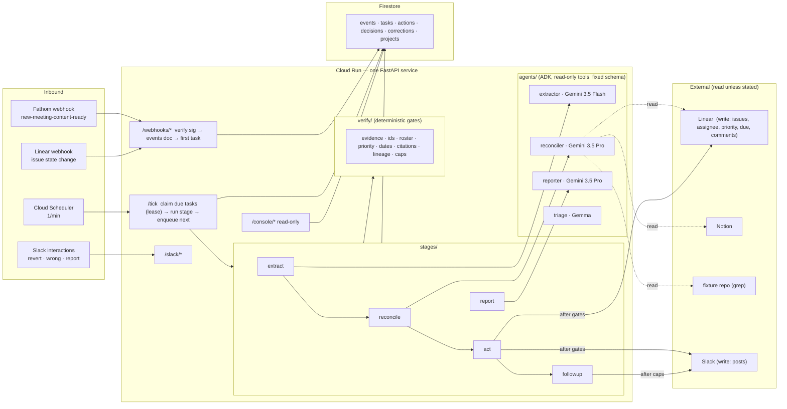

# PM Agent — Design

**Status:** approved design, 2026-08-26
**Deadline:** All Things Agentic Hackathon submission, 2026-08-31 17:00 PDT
**Track:** The Taskmaster (event-driven workflow with autonomous routing)
**Team:** one person

---

## 1. What it is

An autonomous product-manager agent for a software team. A product call ends;
within minutes the agent has extracted the decisions and action items, checked
each one against the tracker and the spec, created and assigned the tickets,
told the team what it did — with a one-tap revert on every action — and
scheduled itself to come back and check that the work moved. On request it
writes a project status report shaped for whoever asked.

It acts on its own. It never guesses: every ticket it writes cites the moment
in the call that justified it, every identifier it uses was looked up, and when
two sources disagree it says so instead of picking a winner.

Origin: DataTruck's internal "Product Agent v0" requirements. The hackathon
build is v0 plus the write side that document deferred, built with the approval
flow and audit trail it said writes needed first. The demo runs against a
synthetic company; no DataTruck data appears anywhere.

## 2. Why this shape

The Taskmaster deep-dive describes "an event-driven workflow with autonomous
routing … watching for a change, figuring out what needs to happen next, and
interacting with different apps to get the job done." Its own example is an
automated PM that reads transcripts and files tickets. That is also the most
obvious entry in the track, so this design wins on what the example lacks:

1. **Closed-loop follow-through.** The agent schedules its own future checks
   and nudges — a durable queue with lineage, not a cron.
2. **Triangulation before action.** Every extracted item is reconciled against
   Linear (duplicate? exists?), Notion (contradicts the spec?) and the code
   (what does it do today?) before anything is written.
3. **Trust as engineering.** Gates the model cannot talk past: verbatim
   evidence, identifier existence, roster membership, priority band, caps.
   Fully autonomous *and* safe to leave running overnight.

Judging weights: Innovation & Operational Utility 40%, Architectural
Discipline 30%, Demo & Production Readiness 30%; +0.2 bonus each for a blog
post, a social post, and each additional Google model (Gemma is used).

## 3. Scope

**In (the spine):**

- Fathom call → extract decisions, action items, open questions (with evidence)
- Reconcile each item against Linear, Notion, and the fixture codebase
- Act: create/update Linear issues; set assignee, priority, due date under
  policy; post a summary to Slack with revert buttons
- Follow-ups: scheduled checks, nudges to assignees, escalation to the channel
- Correction loop: "wrong" on any post → stored correction → applied to
  future runs (soft: prompt; hard: gate rule)
- Decision ledger: every decision from a call is persisted with its source
- Status report on request (Slack), shaped by recipient role
- Read-only web console: queue, audit log, conflicts, corrections, eval results
- Eval set (~25 known-answer questions) run against the fixtures
- Gemma for triage classification (Slack message intent; transcript segment
  pre-filter)

**Out (README roadmap, not built):** free-form Q&A about the codebase, writing
to support articles, adoption/user-report analysis, scheduled reports (one
config flag away; not demoed), cross-team dependency detection, MCP tool
transport, Vertex AI Memory Bank (optional day-3 swap for corrections retrieval;
Firestore otherwise).

## 4. Architecture

**Principle: one runtime, one database, no message bus.** Firestore is the
queue, the audit log, and the memory. Cloud Scheduler ticks once a minute;
Cloud Run does the work.



**Google Cloud services used:** Cloud Run (runtime), Firestore (queue, audit,
memory), Cloud Scheduler (tick), Secret Manager (credentials), Cloud Trace
(OpenTelemetry spans from ADK plus one parent span per task). Models via the
Gemini API: Gemini 3.5 Flash, Gemini 3.5 Pro, Gemma 3. Agent framework: ADK
(Python).

**The agent boundary in one sentence:** Gemini reads and proposes inside a
stage, with read-only tools and a fixed output schema; deterministic Python
owns every queue write, every gate, and every side effect.

### 4.1 Why not Pub/Sub, Cloud Tasks, Agent Engine, or a SequentialAgent

- Webhook handlers write two Firestore docs and return 200 — no bus needed to
  ack fast. A one-minute tick with lease-based claiming gives crash-resumable,
  at-least-once execution with no extra service. Swapping the tick for Cloud
  Tasks is confined to `store/tasks.py`.
- Agent Engine deploys are slow to iterate and its runtime is opaque; write
  governance would have to be bolted around it. Bad trade solo in five days.
- ADK's `SequentialAgent` has no checkpoint between steps; a crash restarts
  from zero. Our stages are separate durable tasks, so a crash resumes at the
  stage that died. The queue is the orchestrator; ADK agents are the workers.

## 5. Data model

Six Firestore collections. Everything crossing a task boundary is JSON-native
(dicts and lists, never dataclasses).

| Collection | One doc = | Fields |
|---|---|---|
| `events` | one inbound webhook or click | `provider`, `provider_event_id` (idempotency key), `payload`, `received_at`, `project_id` |
| `tasks` | one unit of scheduled work | `kind` (extract · reconcile · act · followup · nudge · report), `due_at`, `status` (queued · leased · done · failed · deferred), `lease_until`, `attempts`, `payload`, `result`, `root_event_id`, `parent_task_id`, `depth`, `reason` (one sentence, written by the stage that enqueued it), `project_id` |
| `actions` | one side effect the harness performed | `kind` (linear.create_issue · linear.update_issue · linear.assign · linear.set_priority · linear.set_due · linear.comment · slack.post), `status` (pending · done · failed · reverted), `idempotency_key`, `target_ids`, `inputs`, `citations[]`, `checks_passed[]`, `revert` (inverse payload), `reverted_at`, `reverted_by`, `task_id`, `project_id` |
| `decisions` | one decision extracted from a call | `statement`, `rejected_options[]`, `source` (`fathom:<meeting_id>@<mm:ss>`), `quote`, `linked_issue_ids[]`, `project_id` |
| `corrections` | one human correction | `scope` (project · global), `stage` (extract · reconcile · report · any), `wrong`, `right`, `matcher` (keywords / issue labels the correction applies to), `hard_rule` (optional structured gate rule), `source_action_id`, `author_slack_id` |
| `projects` | one configured project | `slug`, `linear_team_id`, `linear_project_id`, `notion_root_page_id`, `slack_channel_id`, `code_repo` (fixture path), `roster[]` (`name`, `aliases[]`, `linear_user_id`, `slack_id`, `role`), `policy` (see §7) |

Idempotency key for actions: `sha256(root_event_id + item_index + kind)[:16]`,
also stamped into the Linear issue description as a hidden footer
(`<!-- pm-agent:<key> -->`) so Act can detect its own prior write.

## 6. The queue

- **Enqueue** = create a `tasks` doc with `due_at`. Immediate work has
  `due_at = now`. Follow-ups are relative to the decision (`due − 1d`,
  `due`, `+3d` "has it moved?").
- **Tick** (`/tick`, invoked by Cloud Scheduler with an OIDC token) runs one
  transaction per due task: `queued → leased`, `lease_until = now + 15 min`.
  Then runs the stage under a 10-minute hard timeout, so a live stage can never
  outlast its own lease. On completion, marks `done` and creates child tasks
  **in the same transaction** — "did the work but failed to schedule the
  follow-up" cannot happen.
- **Lease expiry** = crash recovery. An expired lease is reclaimable by the
  next tick; `attempts` increments.
- **Lineage gate at enqueue** (`verify/lineage.py`): refuse if
  `depth > policy.max_depth` (default 4) or the parent already has
  `policy.max_children` (default 5). A refused enqueue is recorded in the
  parent's `result`. Runaway chains are structurally impossible.
- **Caps gate at enqueue and at act** (`verify/caps.py`): daily writes per
  project, daily pings per project, quiet hours. Exceeding → `status: deferred`,
  `due_at = next window`. Deferrals are visible in the console; nothing is
  dropped.
- **Ordering:** the tick processes due tasks oldest-first, sequentially per
  request (Cloud Run request timeout set to 15 min; a tick that runs long is
  simply followed by the next one).

## 7. Stages and gates

Each stage is `run(payload: dict, deps: Deps) -> StageResult` where
`StageResult` carries `result: dict`, `enqueue: list[dict]`, `actions: list[dict]`.
A gate failure gives the model **one bounce** with the specific failure; a
second failure drops the item, and the drop is recorded and reported.

### 7.1 extract
- **Input:** Fathom transcript (speaker-labelled, timestamped), summary, action
  items; project roster names for disambiguation.
- **Agent:** `extractor` (Gemini 3.5 Flash, no tools), `output_schema =
  ExtractResult { decisions[], action_items[], open_questions[] }`; every item
  has `evidence[] = { quote, timestamp, speaker }`.
- **Pre-filter:** `triage` (Gemma) labels transcript segments
  decision-bearing / chatter; only decision-bearing segments plus a window of
  context go to the extractor. Reduces tokens and noise.
- **Gate — evidence** (`verify/evidence.py`): each item must carry at least
  one quote that matches the transcript after whitespace and quote-mark
  normalisation. No match → item dropped.
- **Enqueues:** `reconcile` (now). **Persists:** `decisions`.

### 7.2 reconcile
- **Agent:** `reconciler` (Gemini 3.5 Pro) with read-only `FunctionTool`s:
  `search_issues`, `get_issue`, `search_notion`, `get_notion_page`,
  `grep_code`, `list_roster`. `output_schema = ReconcileResult`.
- **Per item output:** `disposition` (new · update `<ISSUE-ID>` · duplicate_of
  `<ISSUE-ID>`), `conflicts[]` (`kind` ∈ code_vs_spec · spec_vs_call ·
  ticket_vs_call, evidence from each side), `owner` (roster name or null),
  `priority` (0–4 or null), `due` (ISO date or null, only if stated in the
  call), `title`, `description` (with citations).
- **Gate — ids** (`verify/ids.py`): every Linear ID, Notion page ID, and
  roster name referenced is re-fetched through the client; unknown → bounce
  once, then the item is marked `unverified` and excluded from Act.
- **Source unavailable:** a tool returning a typed `SourceUnavailable` makes
  the item `unverified`; the task re-enqueues itself once for +30 min to retry
  only the unverified set.
- **Enqueues:** `act` (now).

### 7.3 act (deterministic — the only stage with side effects)
- **Gates, in order:** roster (assignee ∈ roster, else unassigned with a note
  naming who the call named), priority band (within `policy.priority_band`
  unless an evidence quote contains explicit escalation language from
  `policy.escalation_phrases`), dates (`due` only when present from reconcile
  and traceable to a quote), caps.
- **Intent before effect:** create `actions` doc `pending` → perform write →
  mark `done` with `target_ids` and `revert`. On lease reclaim, check Linear
  for the idempotency footer before writing again.
- **Writes:** create issue (description = evidence quote + Fathom link + spec
  check + code check + related issues + decision ledger id + footer) or
  comment on an existing issue; set assignee / priority / due; one Slack post
  per call summarising created / updated / skipped / conflicts, with a
  **revert** button per action and a **wrong** button per post.
- **Conflicts** are posted as "sources disagree" with both sides cited. The
  agent never resolves one.
- **Enqueues:** `followup` per created/updated issue at `due − 1d`, `due`,
  `+3d`; an open-conflict reminder at `+2d` if unresolved.

### 7.4 followup / nudge (deterministic; templated text)
- Fetch issue state. Moved or done → record, stop. Unmoved → nudge assignee in
  the project channel (ping cap, quiet hours). Overdue → escalate to channel.
- Re-enqueue the next check only if still open and lineage allows; when the
  chain ends, the last message says so ("I'll stop checking INV-142 here").

### 7.5 report (on request)
- **Trigger:** Slack `report <project> [for <role>]`; `triage` classifies the
  message intent first.
- **Agent:** `reporter` (Gemini 3.5 Pro) with the reconciler's tools plus
  `list_actions_since`, `list_decisions`, `list_open_conflicts`.
- **Output:** moved · blocked · at-risk (overdue / unmoved) · conflicts · open
  questions · decisions since last report; shape by role (`lead` = per-issue,
  `exec` = per-theme, no IDs unless blocking).
- **Gate — citations** (`verify/citations.py`): every claim carries a
  `linear:` / `notion:` / `fathom:` / `code:` ref that exists. Uncited →
  bounce, then removed.

### 7.6 corrections
- "wrong" button → Slack modal (what was wrong, what is right, applies to:
  this project / everywhere) → `corrections` doc.
- **Soft:** the agent `instruction` is a callable that appends corrections
  whose `matcher` fits the current project and stage.
- **Hard:** a correction with a `hard_rule` (e.g. `never_assign: {label:
  design, role: backend}`) is enforced by the roster gate, never by the prompt.
- Eval set includes "a correction, once made, does not recur".

## 8. ADK agent structure

| Agent | Model | Tools | Output schema |
|---|---|---|---|
| `extractor` | Gemini 3.5 Flash | none | `ExtractResult` |
| `reconciler` | Gemini 3.5 Pro | 6 read-only FunctionTools | `ReconcileResult` |
| `reporter` | Gemini 3.5 Pro | reconciler's + 3 store readers | `Report` |
| `triage` | Gemma 3 (Gemini API) | none | single label |

Exact model IDs are verified against the API on day 1 and set in config, not
hardcoded from memory.

- **`AgentSpec`** (`agents/spec.py`): name, model, instruction (str or
  callable), tools, output schema, `max_tool_calls`, `max_output_tokens`.
- **Read-only enforced twice:** no write tools exist in any agent's tool list,
  and a `before_tool_callback` denies any tool name outside the agent's
  allow-list (logged, run continues).
- **Sessions:** `InMemorySessionService`, one session per stage run, seeded
  with project policy and roster in `session.state`. Firestore is the source
  of truth; ADK session state is scratch.
- **Protocol boundary:** stages depend on `Extractor` / `Reconciler` /
  `Reporter` / `Triage` protocols (`run(payload) -> dict`), so every stage
  test uses a `FakeModel`; each real agent has one `@live` test.
- **Tracing:** ADK's OpenTelemetry spans are exported to Cloud Trace; each
  task run is wrapped in a parent span carrying `task_id`, `root_event_id`,
  `project_id` — one trace from webhook to Linear write.

## 9. Policy (per project, in `projects.policy`)

| Key | Default | Meaning |
|---|---|---|
| `max_depth` | 4 | lineage depth limit |
| `max_children` | 5 | children per parent task |
| `daily_write_cap` | 40 | Linear writes per day |
| `daily_ping_cap` | 10 | human-directed Slack messages per day |
| `quiet_hours` | 20:00–08:00 project TZ | no pings; tasks defer |
| `priority_band` | [2, 4] | Linear priorities assignable without escalation evidence (2 high … 4 low); 1 urgent needs an escalation quote |
| `escalation_phrases` | ["urgent", "blocker", "P0", "asap"] | evidence that permits leaving the band |
| `followup_offsets` | ["-1d", "0d", "+3d"] | check schedule per issue |
| `daily_model_budget_usd` | 5.00 | model spend per project per day; exceeding → defer |

## 10. Failure handling

| Failure | Behavior |
|---|---|
| Webhook redelivered | `events` keyed by `provider_event_id` → no-op, 200 |
| Bad/missing signature | 401; log header names only |
| Fathom event without transcript | event stored; one Slack line; no task |
| Model timeout / 5xx / rate limit | lease expires → retry; `attempts` ≤ 3 with backoff via `due_at` (1m, 5m, 15m) |
| Schema violation | ADK retries once; then treated as model failure |
| Gate failure | one bounce with the specific failure; then drop, record, and report the drop |
| Disallowed tool call | denied by callback; logged; run continues |
| Linear/Notion unavailable in reconcile | items `unverified`; task retries them once at +30 min; Act skips unverified |
| Crash between write and `done` | idempotency footer found on reclaim → no duplicate |
| Partial batch | done items stay done; pending ones retry; Slack summary posted once after the batch settles |
| Roster miss | issue created unassigned with the named person quoted |
| Revert | inverse payload replayed: unassign / previous priority / previous due / cancel (never delete) / edit Slack post; pending follow-ups for a reverted create are cancelled |
| Poison task (3 failures) | `failed`; one Slack notice with reason class; nothing downstream |
| Lineage limit | enqueue refused; parent result records it; last message says the chain ended |
| Cap / quiet hours | `deferred` to next window; visible in console |
| Sources disagree | posted as a conflict; never resolved |
| Unknown code behavior (flags, dead paths) | stated as `unverified` |
| Nothing to extract | one line saying so |

Errors that can reach Slack pass through `core/redact.py` (key names only,
never values).

## 11. Security and data

- Secrets in Secret Manager, mounted as env into Cloud Run. Runtime service
  account: Firestore user, Secret accessor, Trace agent — nothing else.
- Fathom, Linear, and Slack signatures verified before parsing.
- The console is read-only over synthetic data and may be public for judges.
  It renders the same fields the audit log holds; never raw payloads or
  secrets. Real data would put IAP in front (one flag).
- No DataTruck data anywhere: the demo company, its Slack workspace, Linear
  workspace, Notion pages, code, and calls are all fabricated.

## 12. Surfaces

**Slack (the product).** Fresh workspace for the fake company; app installed
via manifest; Events API over HTTP (Cloud Run URL), not Socket Mode. The agent
posts per-call summaries with `revert` / `wrong` actions, nudges, and reports.
Commands: `@pm report <project> [for lead|exec]`.

**Web console (for judges and for us).** Server-rendered HTML on
`/console/*`, read-only: queue (queued / leased / deferred / failed), audit
log with revert status, open conflicts, corrections, decision ledger, eval
results. No JS framework.

## 13. The fake company (fixtures)

**Acme Invoicing** — a small invoicing SaaS: customers, invoices, payments,
a reminders module. Python backend, thin frontend.

- `fixtures/acme-invoicing/` — the repo (real, small, greppable), with
  deliberate texture: a feature flag, a dead code path, a config override, and
  `reminders/scheduler.py` sending reminders at 7 days.
- Notion: a Reminders PRD that says 5 days; an Invoice Export spec; a process
  doc. Created by hand in a Notion workspace; page IDs in `projects`.
- Linear: workspace with team `INV`, one project, ~15 seeded issues via
  `fixtures/linear_seed.py` (some stale, one near-duplicate of a planned item,
  one closed twin).
- Fathom: two or three short Google Meet calls recorded with Fathom, read from
  loose scripts in `fixtures/transcripts/`, with planted moments: a decision
  that contradicts the spec (reminders → 3 days), an owner named who is not in
  the roster, an explicit "urgent" escalation, a due date said aloud, a
  rejected option.
- Roster: 4 fictional people with Linear and Slack accounts in the fake
  workspaces.

Planted conflicts give the eval set known answers and the demo its best
moments; the texture makes them feel found rather than placed.

## 14. Evaluation

`evals/questions.jsonl` (~25) covers: extraction recall on planted items,
duplicate detection, conflict detection (all three kinds), roster miss,
priority band respected and escalation honoured, due date only when stated,
follow-up scheduled and fired, revert correctness, correction non-recurrence,
report citation coverage. `evals/run_evals.py` runs against the fixtures and
prints: factual accuracy, fabricated identifiers (must be 0), citation
coverage (must be 100%), corrections recurred (must be 0). Results go in the
README and the last 20 seconds of the video.

## 15. Repository

```
pm-agent/
  app/
    main.py  config.py
    agents/    extractor.py reconciler.py reporter.py triage.py spec.py tools.py
    stages/    extract.py reconcile.py act.py followup.py report.py
    verify/    evidence.py ids.py roster.py priority.py dates.py citations.py lineage.py caps.py
    store/     firestore.py events.py tasks.py actions.py decisions.py corrections.py projects.py
    clients/   linear.py notion.py fathom.py slack.py code.py
    core/      redact.py tracing.py clock.py keys.py errors.py
    console/   routes.py templates/
  fixtures/  acme-invoicing/ notion/ linear_seed.py transcripts/ roster.json
  evals/     questions.jsonl run_evals.py
  tests/     mirrors app/; fakes/ (FakeFirestore FakeLinear FakeNotion FakeSlack FakeModel)
  deploy/    Dockerfile deploy.sh scheduler.sh secrets.md
  docs/      architecture.md superpowers/specs/ superpowers/plans/
  .github/workflows/ci.yml
```

**Layering (import-linter, from day one):**

| Contract | Why |
|---|---|
| `core`, `store`, `verify`, `clients` never import `agents` or `stages` | gates and queue testable with no model near them |
| `agents` imports only `clients` and `core` | the model cannot reach the store or the queue |
| `stages` never import each other | independent failure domains |
| `console` imports `store` only | structurally read-only |

**Tooling:** uv, Python 3.12, ruff (`E4 E7 E9 F I W B UP`), mypy strict with
no debt list, import-linter, pytest + pytest-asyncio. CI runs exactly those
four gates.

**Conventions:** test names are behavior sentences; hand-rolled fakes, no
mocking frameworks; comments say why, docstrings state contract and failure
behavior; JSON-native across task boundaries; never print secret values;
stage files by name; no AI attribution in commits (AI-assistant use is
disclosed in the README as the hackathon rules require).

## 16. Testing

- **Gates** are pure functions and carry most tests (evidence matching edge
  cases, ID existence, roster/priority/date rules, lineage refusal, cap
  deferral).
- **Queue** against `FakeFirestore` with in-memory transactions: lease expiry
  and reclaim, duplicate webhook no-op, children enqueued in the same
  transaction, deferral.
- **Act** crash-window test: write succeeds, process dies before `done`,
  reclaim finds the footer, no duplicate.
- **Stages** with `FakeModel` canned outputs; one `@live` test per real agent,
  skipped without a key.
- **Clients** against recorded fixtures; no network in CI.
- **Evals** as described in §14.

## 17. Build order (each day ends demoable)

| Day | Build | Demo at end of day |
|---|---|---|
| 1 (Aug 27) | fixtures (repo, Linear seed, Notion pages, record calls), scaffold + CI, config, Firestore stores + queue + tick, Fathom webhook, extract stage + evidence gate | a call ends → decisions and action items appear in Firestore with quotes |
| 2 (Aug 28) | clients (Linear, Notion, code), reconciler agent + tools, ids gate, act stage with all gates, Slack summary with revert/wrong, deploy to Cloud Run | the core loop: call → tickets in Linear, cited, assigned; revert works |
| 3 (Aug 29) | followup/nudge with lineage and caps, corrections (soft + hard), decision ledger, Linear webhook, tracing to Cloud Trace | the agent comes back on its own; a correction sticks |
| 4 (Aug 30) | report stage + citation gate, console, Gemma triage, eval set + runner, README skeleton | everything, end to end, with eval numbers |
| 5 (Aug 31) | architecture diagram, README, 4-minute video (unedited, Cloud Run console visible), blog post, social post, submit before 17:00 PDT | submitted |

Cut order if behind: console → Gemma triage → report shaping by role. Never
cut: gates, eval set, diagram, video.

## 18. Submission checklist

- Category: The Taskmaster
- Public GitHub repo with README: setup (local + Cloud Run), architecture
  diagram, eval results, roadmap, AI-assistant disclosure, prior-art note
  (design lineage from an internal Claude-based harness; all code new)
- Hosted URL: the console on `*.run.app`
- Video ≤ 4 min on YouTube: problem (30s) → a call ends and tickets appear
  (90s) → conflict + revert + correction (60s) → follow-up firing + Cloud Run
  / Trace console (40s) → eval numbers (20s)
- Blog post and social post with #AllThingsAgenticHackathon
- Gemma integration noted for the bonus

## 19. Risks

| Risk | Mitigation |
|---|---|
| Fathom webhook shape differs from docs | day-1 spike: fire one real call before writing the parser |
| Gemini 3.5 model IDs / quotas | verify on day 1; Flash as fallback for Pro |
| Fixture texture too thin, demo feels staged | plant conflicts inside otherwise mundane calls; seed stale issues |
| Solo time slips | daily demoable milestones; cut order fixed in §17 |
| Chatbot perception | video opens on a conflict being found, not on a question |
